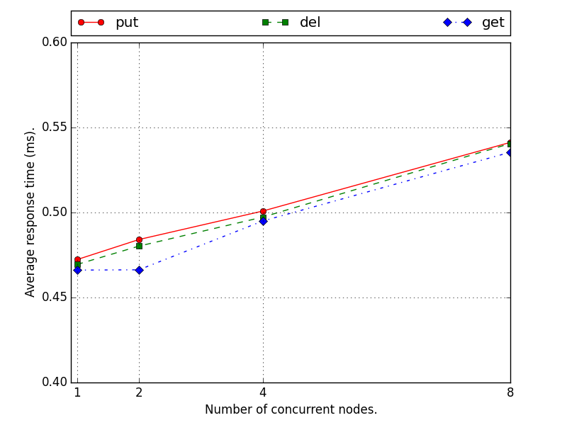
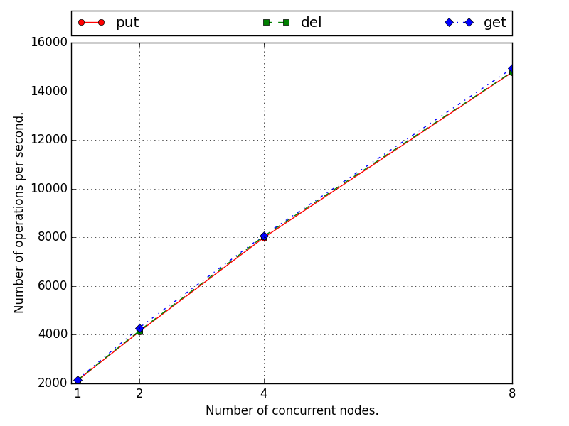

# Report - Programming Assignment #1

## 1. Design documentation

### 1.1. Implementation

To implement this assignment, I chose to use Python for its high level and its possibility to program with sockets. All the communications are based on TCP.

The code is broken down in four parts:

1. the executable code
2. the communication protocol
3. the client
4. the server

In this section, we will start by describing the executable code as it is the code that the user runs first. Then, we will explain how the communication protocol works. Finally, I will give details about the behavior of the client and the server included in each node.

#### 1.1.1. The executable code

The executable code is stored in the class `DHT` of the file `dht/dht.py`. It is the only code ran by the user but it uses all the other parts of the code. To run, it needs a configuration file formatted as described in the manual.

At startup, the `DHT` class is initialized following these steps:

- By looking at the configuration file and comparing its own IP address to the data in the configuration, each `DHT` instance can infer its ID as well as its listening port.
- Inter-processes data structures are initialized and maintained by this class:
  - `hashmap` is the hash table local to the node which is a part of the distributed hash table.
  - `map_lock` is a lock used to access the local hash table to avoid concurrent writes.
  - `terminate` is a integer initialized to 0 and watched by all processes. It can be set to 1 by any process and this indicates that all processes should end in order to quit the program.
- Finally, the server part is launched in a new process and the client part is launched in the main process. Note that the server and client have access to the inter-processes data structures stored in the `DHT` class.

This class also implements the following functions:

- `put <k> <v>` acquires the lock on the hashmap, puts the new entry in the hashmap, and releases the lock.
- `get <k>` acquires the lock on the hashmap, get the value associated with `<k>`, releases the lock, and returns the value.
- `rem <k>` acquires the lock on the hashmap, removes the entry associated with `<k>`, and releases the lock. Note that this function is not named `del` because it is forbidden to create such a function in Python.
- `server_hash <k>` returns the server id (an integer between 0 and 7 in our case) where a given key `<k>` is stored.

#### 1.1.2. The communication protocol

The communication protocol is built over the python sockets. It is made of one class: the `MessageExchanger` class. Each `MessageExchanger` object is built by passing a socket as an argument. The functions of this class hide the protocol to the user. This way, the communication is easier to implement. Conversely to the previous assignment where we chose to implement the communication by indicating the end of a message using a specific string, we use the length of the message to ensure the communication.

When sending a message, we first compute its length and prepend this length to the message on the first 4 bytes. In order to receive a message, we read the first 4 bytes, decode the length `N` of the incoming message and read the following `N` bytes.

This layer is important as it allows the client and the server to be developed without verifying that the whole message has been sent or received. In summary, this protocol allow abstraction of the process. It can also be useful if we decide later to communicate through UDP or MPI instead of TCP as this would reduce the amount of code to modify. Finally, it also allows us avoid code repetition.

#### 1.1.3. The server

First of all, let us recall that the server has access to the main `DHT`.

When launching the server (creation of a `DHTServer` instance), the program is waiting for connections from clients. When a connection is accepted, a new process is created that handles the communication with the peer. This way, our server is multithreaded (which is actually multiprocessing in python). The new process is a message handler that loops until the peer ends the connection. Each message received by the handler is processed by translating the message into a function call to the `DHT` instance.

For example, if the server receives the message `put abc def`, then it will call the function `put` in the `DHT` instance with the arguments `key=abc` and `value=def`. It gets back the return value of the function and communicate this value through the socket that has made the request.

#### 1.1.4. The client

Similarly to the server, a client instance `DHTClient` on a node has access to the main `DHT` instance where the hashmap is maintained. Each client instance maintains a table `socket_map` associating a node id with a socket in order to communicate with the other nodes.
The manual explains what commands are accepted by the client, we explain here what steps are executed when running a `put`, `get` or `del` command:

- The client computes the server id `SID` where the key is supposed to be stored or retrieved.
- If `SID` matches with the id of the instance, then `DHTClient` directly calls the method in the local `DHT` instance without using network communication. Otherwise, it retrieves the socket associated with `SID`. Once again, this step is broken down in two cases:
  - If it is the first time that a connection is needed with server `SID`, then a socket is created, the connection is made with the server, and the new socket is stored in the table `socket_map`.
  - If `SID` can be found in `socket_map`, then the corresponding socket is returned.
This technique allows us to run all the nodes required for the assignment without paying attention to the connection between each node. Indeed, the connections are made when needed the first time and they are kept open for the whole lifetime of the program. One the correct socket has been retrieved, the command is sent to the distant server, the client waits for a return value through the socket and displays this return value to the user.

### 1.2. Possible improvements

In the actual implementation, one process is created every time a connection is accepted. This part of the code could be improved by created a static pool of processes that get the accepted connections from a shared queue. This would improve the performance in the case of a very large number of connections.

## 2. Perfomance evaluation

In order to evaluate the performance of our system, we launched eight c3.large instances on Amazon EC2 and sequentially run 100,000 `put`, `get`, and `del` operations.

In order to see how the system scales, we have increased the number of nodes concurrently running this operations from 1 to 8.

The above figure displays the average response time per query for the put, get, and del operations. We can see that the response time slightly increases when adding concurrency but it stays around 0.5 ms per request. The results are similar for all types of operations and shows that the system scales well.
Another way to see how the system scales is to compute the number of operations per second of the whole system:

We can see on this figure that by launching more nodes in parallel, we get a better performance and this performance increases linearly with the number of nodes running concurrently. This shows that our program scales well up to 8 nodes keeping a speed of about 2,000 operations per node per second.

In conclusion, we have implemented and benchmarked a distributed hashtable as the second step into a distributed file sharing system. Even though the system can still be improved, every required function (put, get, del) has been implemented and is fully functional.
