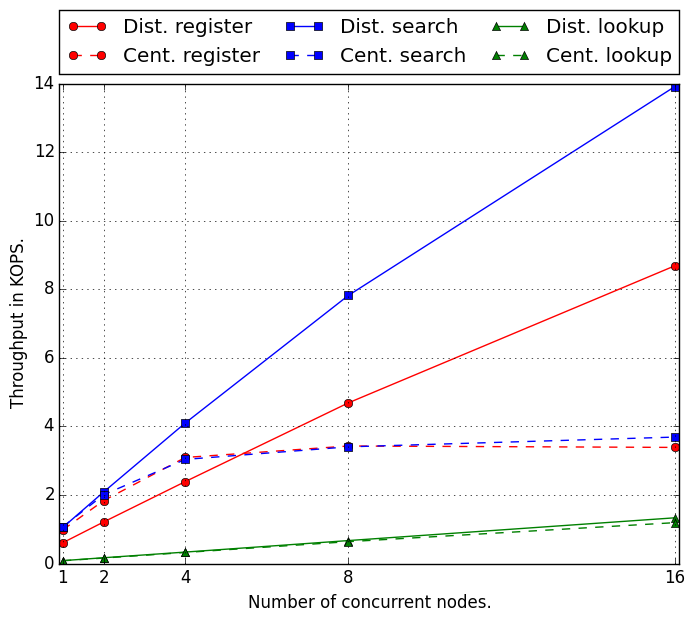
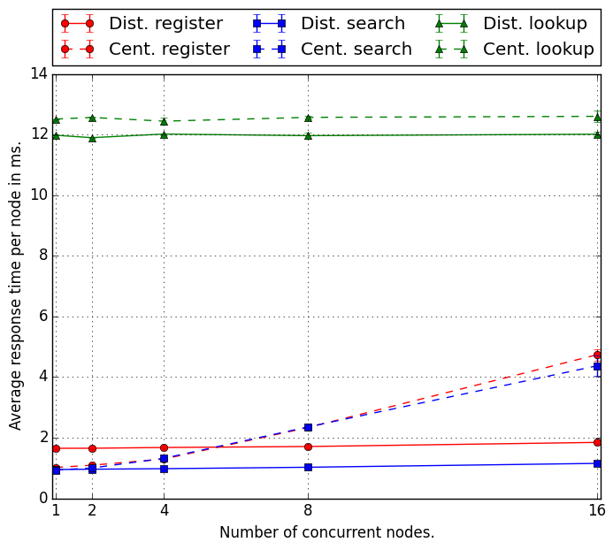
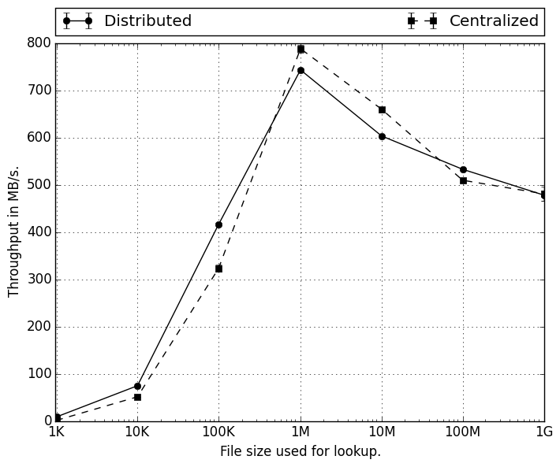

# Report - Programming Assignment #3

## 1. Design documentation

To implement this assignment, I chose to use Python for its high level and its possibility to program with sockets. All the communications are based on TCP. Note that the following Python package `numpy` is required to run the program.

The code is broken down in four parts:

1. the main code
2. the communication protocol
3. the user interface
4. the file server
5. the indexing server implementation (two types)
6. the indexing server proxy

In this section, we will start by describing the executable code as it is the code that the user runs first. Then, we will explain how the communication protocol works. Finally, I will give details about the behavior of the client and the server included in each node.

### 1.1. The main code

The main code is stored in the class `Node` of the file `dfs/node.py`. It is the only code ran by the user but it uses all the other parts of the code. To run, it needs a configuration file.

At startup, the `Node` class is initialized following these steps:

- By looking at the configuration file and comparing its own IP address to the data in the configuration, each `Node` instance can infer its ID.
- Inter-processes data structures are initialized and maintained by this class:
  - `local_files` is the hash table local to the node which associates a file name to its local path.
  - `terminate` is an integer initialized to 0 and watched by all processes. It can be set to 1 by any process and this indicates that all processes should end in order to quit the program.
- Once the configuration step is over, the file server part is launched in a new process as well as the indexing server if the system deployed is set to `distributed`.
- Finally, the user interface is launched in the main process. Note that the file server, the indexing server, and the user interface have access to the inter-processes data structures stored in the `Node` class.

### 1.2. The communication protocol

The communication protocol is built over the python sockets. It is made of one class: the `MessageExchanger` class. Each `MessageExchanger` object is built by passing a socket as an argument. The functions of this class hide the protocol to the user. This way, the communication is easier to implement. We use the length of the message to ensure the communication.

When sending a message, we first compute its length and prepend this length to the message on the first 4 bytes. In order to receive a message, we read the first 4 bytes, decode the length `N` of the incoming message and read the following `N` bytes.

When sending a file, we first compute its size by executing a system call and prepend the size to the content of the file. As we code the size of the file on 4 bytes as an unsigned int, we can code up to 2^32 limiting the size of the file to 4GB.

This layer is important as it allows the client and the server to be developed without verifying that the whole message has been sent or received. In summary, this protocol allow abstraction of the process. It can also be useful if we decide later to communicate through UDP or MPI instead of TCP as this would reduce the amount of code to modify. Finally, it also allows us avoid code repetition.

### 1.3. The user interface

The user interface accepts user inputs describe in the manual.

### 1.4. The file server

The file server is a modified version of the server from the first assignment. It uses a non blocking socket waiting for connections from other nodes. When a new node connects to it, it processes the client's requests until receiving an `exit` message. The requests can be:

  - `obtain <name>` is received when another node requests for a file transfer for the file named `<name>`. If the file is stored on this node, it returns True and then start transferring the file. Otherwise, it returns False.
  - `recv_replica <name>` is received when a distant node is initiating a file replication. In this case, the node gets ready to receive a file, stores it locally and add it to the local hashmap that associates its name to its local path.

### 1.5. The indexing server proxy

The `ISProxy` class is an abstract class that defines the functions `search`, `register`, and `lookup`. We implemented one version for the centralized system, and one for the distributed system. Each user interface has a version of the indexing server proxy corresponding to the configuration.

The centralized version has a single socket connected to the centralized indexing server and forward the requests `search`, `register`, and `lookup` in the corresponding function.

The distributed version forwards all the functions to the correct node. To do so, it uses a hash function (md5) on the name of the file the user wants to process and the modulo to the number of nodes to redirect the function call to the correct node.

### 1.6. The indexing server

There are two versions of the indexing server: centralized or distributed. The centralized version is made from the code of the first assignment and the distributed version leverages the code from the second assignment to implement the `search`, `register`, and `lookup` operations.

### 1.7. Other requirements

For this assignment, it was required to implement replication of the files as well as the metadata in the case of a distributed indexing server.

This is done as follows:

- File replication: when registering a file, a client communicates with an indexing server and sends a `register` message. The indexing server executes the request and sends back the results of the request. Additionally, the indexing server sends the addresses of the node where the file needs to be replicated and add these addresses to the hashmap associating a file name with peers where this file can be downloaded. The process of replication is then initiated by the node that just registered the file. To do so, it sends a `recv_replica` request to the nodes received from the indexing server's response.
- Metadata replication: in the case of a distributed system, when a key-value pair is added to the distributed hash table on node i, it is also added to the distributed hash table node i+1. This way, if node i is done, metadata can be retrieved from node i+1.

## 2. Perfomance evaluation

In order to evaluate the performance of our system, we launched 16 m3.large instances on Amazon EC2 and ran the benchmarks described in the assignment's description.

The following figure displays the throughput in thousands of operations per second given the number of concurrent nodes running the operations. It displays the throughput for the three possible operations (`search` in blue, `register` in red, and `lookup` in green) and the two types of systems (distributed in solid line and centralized in dashed line).

We can see that the performance for the register and search operations scales very well with the number of nodes in the case of the distributed system as the aggregated throughput increase linearly with the number of concurrent nodes. On the opposite, the centralized system starts by scaling well (up to 4 nodes) but then struggles to get performance improvement when adding concurrent nodes. This is most probably due to the fact that the indexing server is central and is therefore a bottleneck for the performance. In the case of the `lookup` operations, we cannot see the same effect as the time to download the files (of size 1K) allows the central indexing server some time to process the other requests.

The above figure displays the average response time per request once again for the two types of systems and the three types of operations. The remarks from the previous paragraph can be reiterated here as we can see that the response time increases when adding concurrent nodes in the case of the centralized system for the `register` and `search` operations. Once again, this is due to the fact that the central indexing server gets overloaded with request. That does not happen in the distributed system as the `register` and `search` requests are distributed over all the nodes.

The following figure displays the throughput in MB per second in the case where 16 EC2 instances are running. We registered files of different sizes (from 1K to 1G) on all the nodes. For a given size, each node sequentially requests a `lookup` for all the files of this size that are stored in the distant nodes.

We can see that the centralized and distributed systems have relatively close results of throughput with a peak at 800 MB per second when the size of the files transfered is 1MB. The throughput is particularly low when file are very small. This might be due to the fact that the overhead of reading and writing a file to disk is too high compared to the size of the file. This makes sense as we have seen in the previous graphs that the problem encountered by the centralized system (central indexing server being a bottleneck) does not appear in the case of `lookup` operations. Indeed, the number of requests send to the indexing server are not enough to overload it.

In conclusion, we have implemented and benchmarked two file systems: a centralized one and a distributed one. We designed our system such that it accepts text files and binary files up to 4 GB. We also implemented replication of the files and the metadata. as the second step into a distributed file sharing system. We have seen in the first two graphs that the distributed system scales very well for the `search` and `register` operations but it does as well as the central system for the `lookup` operations. Interesting future work would be to study more in depth why the performance is not improved in the `lookup` operations.
